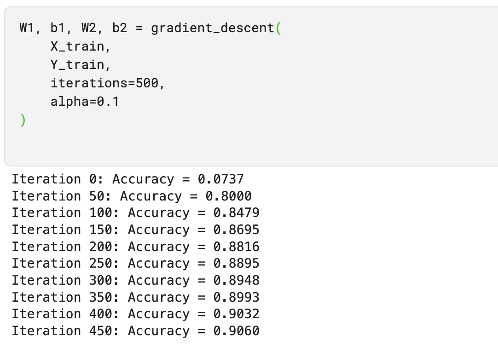
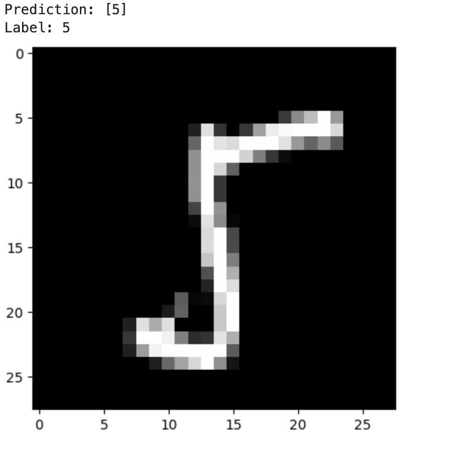

# 🧠 MNIST Neural Network From Scratch

A handwritten digit classifier built completely from scratch using only NumPy.

## What this project uses ✅

✅ Linear Algebra  
✅ Calculus & Chain Rule  
✅ Forward Propagation  
✅ Backpropagation  
✅ Gradient Descent  
✅ ReLU Activation  
✅ Softmax Output Layer  
✅ One-Hot Encoding  
✅ Matrix Operations with NumPy  
✅ Neural Network Training from First Principles  

## What this project DOES NOT use ❌

❌ TensorFlow  
❌ PyTorch  
❌ Scikit-Learn Models  
❌ Keras  
❌ High-Level Deep Learning Libraries  
❌ Pre-Built Neural Network APIs  

## Results 📈

### Training Accuracy

### Example Prediction

🎯 ~90% Accuracy on MNIST

## Why I Built This

Before using modern frameworks, I wanted to understand how neural networks actually work under the hood.

This project implements every major component manually—from parameter initialization and forward propagation to backpropagation and gradient descent—using only NumPy and mathematical principles.
